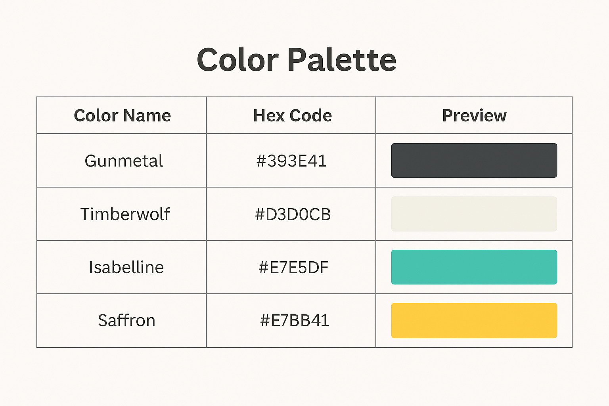
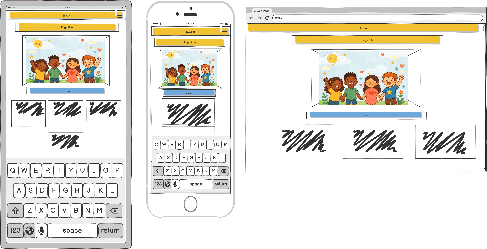
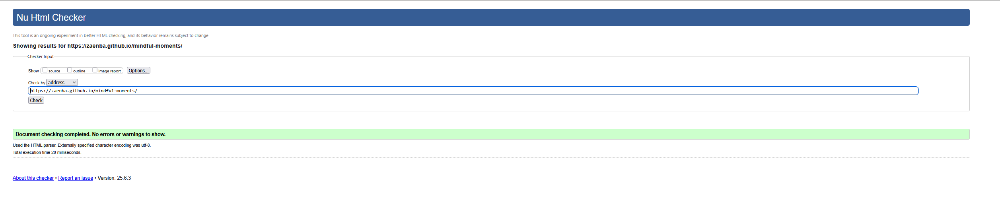
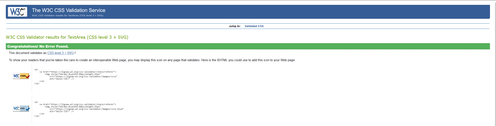
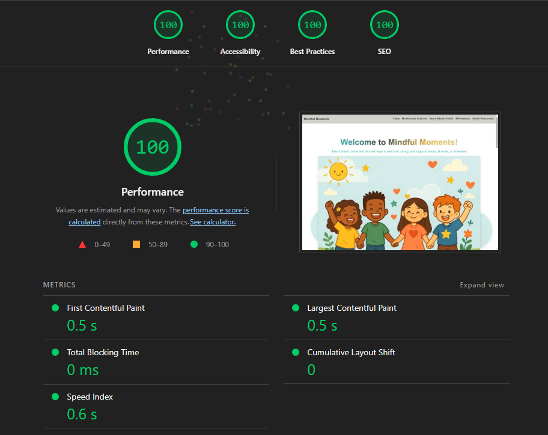
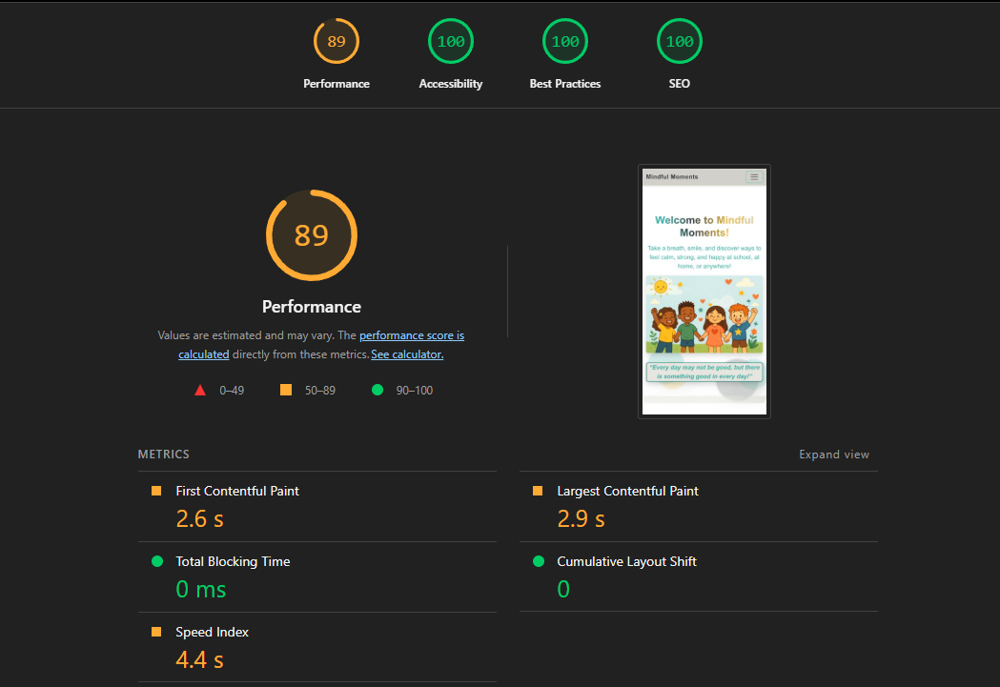

# **Mindful Moments**

    Image of website / amiresponsive:

     

*Link to Live website — [View Live Website](https://zaenba.github.io/mindful-moments/)*

## **Project Overview**
Our mental health affects how we think, feel and get along with other people. By going through these big feelings, and can sometimes feel a little too much for us to handle, it helps us understand how we can handle stress, be able to relate to others, and make choices in those moments. Mental health is important for everyone, from when we are babies, to when we grow up and become adults.

This website is created specifically to support children’s mental health, wellbeing, and mindfulness. It’s designed to help children understand and manage their big emotions in a safe, supportive environment. Parents can use it at home to guide their children, while schools can incorporate it into the classroom to encourage mindfulness. Although the main focus is on children, the website also serves as a helpful tool for parents, guardians, and educators to promote positive mental health and wellbeing for kids.

---

## **Table of Contents**

[User Stories](#user-stories)
-[UX Design](#ux-design)
-[Features](#features)
-[Deployment](#deployment)
-[AI Implementation](#ai-implementation)
-[Testing and Validation](#testing-and-validation)
-[References / external links](#references)
-[Credits](#credits)

---

# User Stories
As a user, I want to be able to feel calm when entering the website:
- Soft visuals
- Pastel colours
- Gentle animations (e.g. floating bubbles from bottom to top, varies colours)
- Calming headline ("Welcome to Mindful Moments")

As a child, I want to find fun and easy mindfulness exercises, so I can feel calm and happy when I’m worried or upset.
 - An activity the child can practice while on the webpage (e.g. trace and breathe exercise/ a normal breathing exercise).
- Activity needs to be interactive for the children such as clickable breathing exercise, or being able to trace by mouse or finger.
- Positive message box (with audio option).

As a user, I want to understand what positive well being and mindfulness means and looks like.
- Simple and friendly explanation
- Add short facts or tips about mindfulness and well being.
- Use friendly language

As a child, I want to read so I can feel encouraged and know it’s okay to ask for help.
- Add positive message box up to 3 messages.

As a parent, I want to access trustworthy information about children’s mental health, so I can support my child’s well being safely at home or anywhere.
- Short, clear information about mental health, mindfulness and positive well being.
- Add helpful links to pages such as NHS or BBC to better support the parent to help their child.

As an educator, I want to access easy and simple mindfulness activities suitable for the classroom, so that I can help my students feel calm and ready to learn in a safe and calming environment.
- Find easy activity to use in a classroom setting.

# UX Design
# **Theme colors:**
- These colors were chosen because they are intended for the user to feel at ease when accessing the website without feeling overwhelmed with bright flashy colors. There are animated floating bubbles to give it that little extra sensory moment for children that may suffer from autism and/ or other mental health concerns.

# **Wireframes:**

# **Fonts used:**
- Lato
- Oswald
These fonts were chosen as they are clear and simple to read and they have a soft touch to the website and do not have harsh edges around. Very good for the intended users. 

# Features

# Deployment
This was done through GitHub. 

# AI Implementation

# Testing and Validation

During the process of making Mindful Moments website, testing and validating the code was done throughout the timeframe of the deadline. In it, I had to make sure I completed regular debugging which was done by either the live preview on VS Code and mostly on the Chrome Browser which had great Dev Tools to support in this matter.

**W3Schools HTML Validator:**

**Lighthouse:**

# References / external links

# Credits

