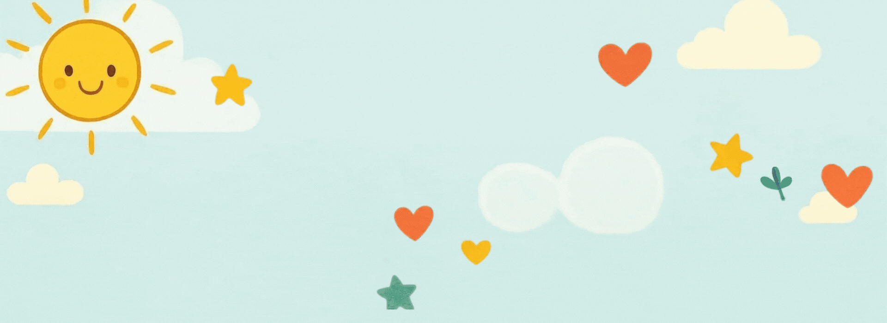

# **Mindful Moments**

 *[View Live Website](https://zaenba.github.io/mindful-moments/)*

## **Project Overview**

This website is created specifically to support children’s mental health, wellbeing, and mindfulness. It’s designed to help children understand and manage their big emotions in a safe, supportive environment. Parents can use it at home to guide their children, while schools can incorporate it into the classroom to encourage mindfulness. Although the main focus is on children, the website also serves as a helpful tool for parents, guardians, and educators to promote positive mental health and wellbeing for kids.

---

## **Table of Contents**

- [User Stories](#user-stories)
- [UX Design](#ux-design)
- [Features](#features)
- [Deployment](#deployment)
- [AI Implementation](#ai-implementation)
- [Testing and Validation](#testing-and-validation)
- [References / external links](#references)

---

# **User Stories:**
As a user, I want to be able to feel calm when entering the website:
- Soft visuals
- Pastel colours
- Gentle animations (e.g. floating bubbles from bottom to top, varies colours)
- Calming headline ("Welcome to Mindful Moments")

As a child, I want to find fun and easy mindfulness exercises, so I can feel calm and happy when I’m worried or upset.
 - An activity the child can practice while on the webpage (e.g. trace and breathe exercise/ a normal breathing exercise).
- Activity needs to be interactive for the children such as clickable breathing exercise, or being able to trace by mouse or finger.
- Positive message box (with audio option).

As a user, I want to understand what positive well being and mindfulness means and looks like.
- Simple and friendly explanation
- Add short facts or tips about mindfulness and well being.
- Use friendly language

As a child, I want to read so I can feel encouraged and know it’s okay to ask for help.
- Add positive message box up to 3 messages.

As a parent, I want to access trustworthy information about children’s mental health, so I can support my child’s well being safely at home or anywhere.
- Short, clear information about mental health, mindfulness and positive well being.
- Add helpful links to pages such as NHS or BBC to better support the parent to help their child.

As an educator, I want to access easy and simple mindfulness activities suitable for the classroom, so that I can help my students feel calm and ready to learn in a safe and calming environment.
- Find easy activity to use in a classroom setting.

# **UX Design**
# *Theme colors:*
- These colors were chosen because they are intended for the user to feel at ease when accessing the website without feeling overwhelmed with bright flashy colors. There are animated floating bubbles to give it that little extra sensory moment for children that may suffer from autism and/ or other mental health concerns. Colors were selected by [**Coolors**](https://coolors.co/393e41-d3d0cb-e7e5df-44bba4-e7bb41)

# *Wireframes:*

*Responsive Design:*

# *Fonts used:*
- Lato
- Oswald

These fonts were chosen as they are clear and simple to read and they have a soft touch to the website and do not have harsh edges around. Very good for the intended users. These fonts were implemeted by [**Google fonts**](https://fonts.googleapis.com/css2?family=Lato:wght@300&family=Oswald:wght@200;300;400;500;600;700&display=swap)

# **Features:**

- Added interactive flip cards for children made sure they were easy to read and access.
- A simple and easy to follow exercise users can use immediataly.
- Added floating bubbles with the help of ChatGPT to format the correct code for these bubbles to be animated in the background softly and easily blends well with the theme of the colours and fonts.
*Example:*

- Easy to read format.
- Easy access to helpful links if needed.
- Easy to understand.

# **Deployment:**
This was done through GitHub. [GitHub](https://github.com/)

# **AI Implementation:**
In my website project, I used different AI models to help with various sections, making the site as calming and relaxing as possible. AI also assisted me in generating the right images for the project. There was a lot of trial and error, even though sometimes ChatGPT and Canva’s AI didn’t fully understand my prompts, however this turned out to be a valuable learning curve. It helped me figure out how to prompt AI tools more effectively, which led to great results, including the images ChatGPT generated for me. I also used Canva to resize and convert image files, which helped solve some minor issues I faced with Lighthouse. Once that was sorted, everything worked smoothly!!!

- Tools I used:
     - [ChatGPT](https://chatgpt.com/): For generating code and images as well as, framing activities that users can use anywhere.
    - [Canva](https://www.canva.com/): For design ideas, converting image files, and resizing.
    - [GitHub](https://github.com/features/copilot) Copilot: For debugging and analyzing my code.
    - [CodePen](https://codepen.io/): For debugging my code in real time.

I made sure my project met all the requirements and was inclusive and fair for everyone who might use it.

Using AI significantly reduced the time it took to implement certain aspects of my code. Fast image generation meant I didn’t have to search for images online, which really brought my idea to life. Ultimately, AI helped me finish my project within the given timeframe with a lot less STRESS!

# **Testing and Validation:**

During the process of making Mindful Moments website, testing and validating the code was done throughout the timeframe of the deadline. In it, I had to make sure I completed regular debugging which was done by either the live preview on VS Code and mostly on the Chrome Browser which had great Dev Tools to support in this matter.

**W3Schools HTML Validator:**

**Lighthouse:**

# **References / external links:**
The following links have helped in picking out, the right and useful information for the webpage about mental health:
- [NHS - children and Young adults](https://www.nhs.uk/mental-health/children-and-young-adults/)
- [BBC - Kids](https://www.bbc.co.uk/bitesize/articles/zndp6v4)
- [Cosmic Kids](https://cosmickids.com/?s=mindfulness)

The following are links that helped me during the project:
- [CodeInstitute](https://codeinstitute.net/): Had great and easy lessons to understand HTML and CSS.
- [Balsamiq](https://balsamiq.com/): Creating wireframe.
- [Bootstrap](https://getbootstrap.com/docs/5.3/helpers/color-background/): Helped with colors and backgrounds, as well as the navbar and other sections.

